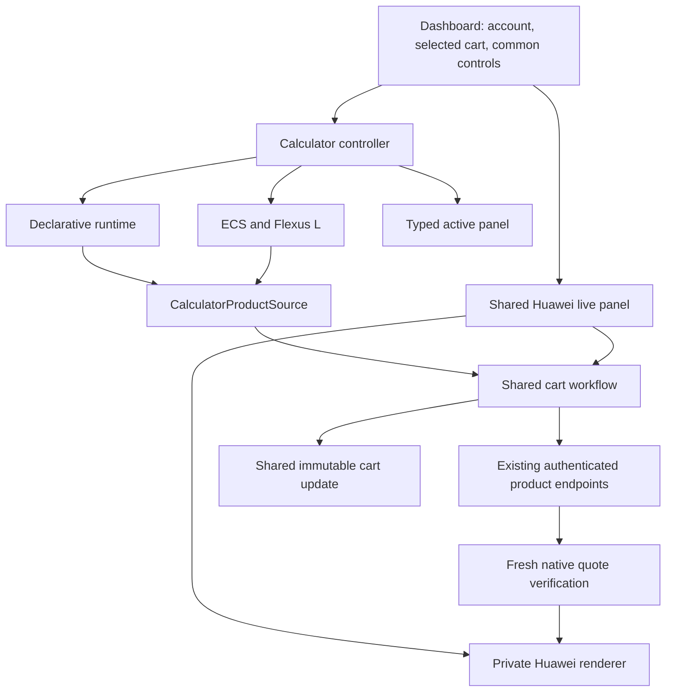

# Calculator architecture and Huawei integration seam

The main workspace offers the existing Price Calculator and a Huawei live tab. Both save to the same projects and carts. Existing saved products keep their original runtime; native products use a versioned replayable configuration.

## Responsibilities

- `lib/calculator-types.ts` owns shared calculator and saved-product contracts without importing React, UI formatting, storage or a pricing engine. Existing JSON fields and API response shapes remain unchanged.
- The declarative runtime owns its fields, visibility, catalogs, estimates, product construction and hydration. ECS and Flexus L retain their custom implementations.
- `lib/calculator-presentation.ts` only formats the custom ECS/Flexus L calculations. Declarative services no longer have a second, unused presentation implementation. The hardcoded sample ECS price fallback has been removed.
- `CalculatorPanelRouter` accepts one discriminated, fully typed active panel. Adding another panel requires a checked union case rather than casting through `unknown`/`never`.
- `lib/calculator-cart.ts` owns save/edit/split/batch sequencing and acknowledged cart updates. Both runtime implementations use its `CalculatorProductSource` interface. Clipboard insertion uses the same state update while preserving its existing append order.
- The controller selects the runtime, coordinates common controls and edit hydration, and supplies the cart writer. The dashboard retains account/project/list UI. Server repricing continues to use its existing ECS, Flexus L, declarative and synchronized-service paths.

## Product source contract

A source builds one saved product, several split products, or `null` if no configuration can be built. Builders may be synchronous or asynchronous. A source can optionally build batch items and customize success messages. It has no knowledge of cart identifiers, HTTP requests or React state.

The writer is injected. Saves update the original item first when editing; split extras are added to the selected destination list. Batch items are converted and saved in order. Each acknowledged write updates local state immediately, so a later failure preserves earlier successful saves. Batch errors report how many products were saved. These operations retain the existing sequential, nontransactional behavior; retrying an entire partially saved batch is not an idempotent operation.

Pricing is opaque to the cart workflow. It never recomputes, rounds or multiplies a source's price. Quantity and configuration are passed through unchanged. Validation and authentication at the existing endpoints remain in effect.

## Huawei live integration

`NativeCalculatorPanel` is shared by the main workspace and the preview. It discovers services and regions through `/api/calculator/native`; `/api/sync-lab/live` remains a compatibility alias. The main dashboard supplies the existing cart writer and uses `saveCalculatorProducts` for save/edit operations. Opening a native cart item selects the Huawei live tab and replays its saved configuration. Switching to a different runtime cancels the current edit.

Native products have `productType: huawei-native`, `serviceCode: HUAWEI:<Huawei ID>`, and a versioned `config.selection`. The selection records initial controls, validated interactions (including repeated disk actions), and final control values/option labels. It contains no persistent browser session dependency. Replaying checks initial defaults, each control identity/option label and the complete final selection. Changed upstream defaults or unavailable options require reconfiguration; they cannot silently quote another product.

Authenticated product POST/PATCH endpoints ignore client-supplied native prices. `verifyNativeProduct` asks the private renderer for a fresh quote of the exact session revision, or replays a durable selection if no session is supplied. Only the resulting server selection, source hashes, quantity and price are persisted; transient session IDs are stripped. Private API repricing uses the same verifier. Import/export and cloning retain saved snapshots; they do not imply a new live quote or automatic conversion to another region/billing mode.

The Huawei runtime currently supports pay-per-use. The existing runtime remains available for monthly/yearly, RI and legacy batch inputs. The live directory discovers new services automatically; unknown controls or incomplete inquiries block pricing. Source refresh, expiry, capacity and unavailable-upstream behavior remain in the native sidecar.

## Shared core

- The projects page and dashboard share project mutations, sharing, transfer, project cloning, product contracts and summaries. Page-specific list management and layouts remain local.
- `evaluateServiceConfiguration` owns catalog derivation and estimate scope construction for interactive forms, batch items and server repricing.
- Catalog data, resolved region, loading and error state are a single entry keyed by service and requested region. A different region cannot temporarily use the previous region's catalog.
- All service bundles use the same runtime definition type. The eight former legacy bundles now use compiled callbacks for complex expressions. The string evaluator, `new Function` execution and legacy converter are removed. Declarative fields and existing typed operations remain supported.
- The callback migration is checked against 28 captured pre-change configurations in addition to existing pricing fixtures.

## Verification

- `bun run test`: existing pricing/runtime fixtures plus cart workflow failure/ordering tests and ECS/Flexus L presentation checks.
- `bunx tsc --noEmit` and `bun run lint`.
- `bunx playwright test --config tests/playwright.config.ts`: eight declarative forms, public routes, saved-cart edit/batch/clone/share/export/import, and ECS/Flexus L save/edit/batch scenarios. Run write scenarios only against an isolated local app database.
- Production build and read-only browser checks against the deployed app.

With an isolated native sidecar, `NEO_NATIVE_TESTS=1 bunx playwright test --config tests/playwright.config.ts` also exercises the main native cart, durable selection replay, authenticated/private API verification, and invalid saved configuration recovery. Write tests reject production hostnames.

These checks establish regression coverage for the refactor, not universal parity of every legacy calculator with Huawei. Native parity evidence remains documented separately in `huawei-native-calculator.md`.

## Dashboard modules

The route in `app/page.tsx` only composes views. Stateful feature logic lives in `lib/dashboard`, and rendered dashboard sections live in `components/dashboard`.

| Module | Owns |
| --- | --- |
| `use-project-store` | Loaded projects, selected cart, project/list indexes and snapshot refresh |
| `use-project-actions` | Create, rename and delete project/cart operations |
| `use-resource-cloning` | Clone options, requests and result messages |
| `use-resource-sharing` | Share links and progress/messages |
| `use-resource-transfer` | JSON import/export and workbook export |
| `use-huawei-carts` | Saved Huawei credentials, remote cart listing, linking and synchronization |
| `use-cart-contents` | Cart search/filter/sort, selection, deletion and clipboard operations |
| `use-dashboard-url` | URL restoration, navigation events and URL serialization |
| `use-calculator-shortcuts` / `use-dashboard-keyboard` | Calculator navigation and dashboard/clipboard shortcuts |
| `use-dashboard` | Composition of feature hooks, common selection state and navbar coordination |

The views receive typed feature objects and common display state. Menu definitions and dialog display values belong to the views that render them. Feature hooks own their pending/error state; the project store owns the shared project snapshot. Hooks receive the specific setters/actions they need, without a global dashboard context or a second copy of project data.

URL restoration waits for session resolution and the current user's project load before opening a saved product or action dialog. The project store discards an initial load response if the user changes or the hook unmounts. This makes readiness explicit instead of relying on effect order between modules.

Custom calculator coordination is separate from the shared controller:

- `lib/use-calculator-controller.tsx` selects the runtime and coordinates billing, quantities, edit hydration and the shared cart workflow.
- `lib/calculator/controller-types.ts` defines the controller's public interface.
- `lib/calculator/use-custom-calculator.tsx` owns ECS/Flexus flavor selection, presentation, saved-product hydration and service URL state, using the existing ECS catalog hook.
- `lib/calculator/use-ecs-disk.ts` owns disk controls, bounds and dependent IOPS/throughput normalization. The custom runtime adds the complete compute/disk selection summary to its panel.

Keep new feature behavior in its owning hook and view. The route should remain layout-only, and the composition hook should not acquire request implementations or service-specific pricing rules. The native Huawei runtime is isolated behind its form/session interface and server verifier.
