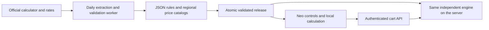

# Calculator architecture

The active calculator uses Neo's independent rule engine and a daily published data catalog. The synchronization worker is the only process that contacts Huawei or uses Chromium. See [the runtime and synchronization contract](standalone-calculator.md).

`lib/calculator-rules` owns the restricted rule format/compiler, evaluator, catalog selection, controls, specialized forms, state transitions, billing terms and resource transformations. `compile.ts` and `oracle.ts` are worker-only modules. `engine.ts` has no I/O and runs in both browser and API contexts.

`lib/huawei-snapshot` owns extraction, price calibration, coverage, immutable storage, publication and local rating. `client.ts` caches JSON models and owns browser sessions; `product.ts` reconstructs saved or submitted choices and discards client totals. The app mounts snapshots read-only. The worker owns writable snapshots and runs once per day, retaining the previous complete release on failure.

The existing React calculator panel, ECS flavor cards, project/cart UI, save/edit/batch workflow, account permissions and import/export remain shared. Versioned selections store choices and interactions without a persistent browser session. Legacy saved releases are reconstructed using the independent catalog when reopened or repriced; missing options require review.

Pricing is verified with exact decimal conversions, term/payment rules, tiers and recorded Huawei inquiry responses. Publication requires independent controls, dimensions and prices to match in every advertised service/region/mode, including availability zones. New official services enter the same discovery and validation pipeline. Unsupported changes fail the release gate, never trigger a vendor UI fallback.

Validation includes unit/rule/security tests, TypeScript and lint, oracle comparisons, API tampering and cart tests, browser tests with all HTTP blocked after opening a scope, and an application container with no internet access. Public deployment must use a complete independent release; a partially compiled test catalog is not production evidence.
