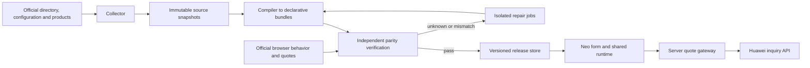

# Autonomous Huawei calculator synchronization

Status: original roadmap, 2026-09-28. A bounded pay-per-use implementation now exists; see [implementation, operational settings, and remaining coverage](huawei-sync-implementation.md). Sections below describe the broader target and must not be read as a list of completed capabilities.

Research update, 2026-09-29: [fresh response audit](huawei-calculator-response-audit.md) supports prioritizing a deterministic compatibility adapter. Configuration callbacks are explicit executable rules; JavaScript alone is not evidence that AI interpretation is necessary. Prototype preserving supported callbacks in an isolated engine alongside compilation to the existing expression system. Treat AI repair below as optional fallback tooling, not a prerequisite for ordinary updates or compatible new services.

## Outcome and scope

Make Huawei's international public calculator the source of truth for service availability, supported configurations, conditional form behavior, quote requests, and displayed prices. Keep Neo's projects, carts, batch operations, sharing, API, import/export, and shadcn presentation.

Initial scope is the anonymous international English calculator, its public USD prices, and every region/billing mode it exposes for each discovered service. Account-specific contracts, checkout totals, taxes not represented by that calculator, and other Huawei sites are separate scopes. Matching the public calculator does not establish invoice accuracy.

The system should discover, update, validate, publish, retry, and roll back without routine human approval. It must distinguish supported, verified behavior from behavior still under investigation. Arbitrary future changes cannot be guaranteed to compile or be proven correct automatically; unresolved changes must never silently become verified features.

## Evidence from this repository and upstream

- The repository already fetches Huawei `productInfo` catalogs and has a shared declarative service runtime. However, form definitions and important mappings remain handwritten. Refreshing product prices alone cannot update these rules.
- DCS currently declares only the Basic pay-per-use flow. Its available products are deliberately filtered. Existing functionality tests are therefore not evidence of complete Huawei coverage.
- On 2026-09-28, direct requests through the existing Huawei proxy returned HTTP 200 for the `config` endpoint for `redis`, `vpn`, and `ecs`. All three responses parsed as JavaScript without syntax errors. They are executable configuration, not a documented universal JSON form schema.
- The sampled scripts contain `dataConfig`, `viewConfig`, translations, product transformations, and functions. DCS includes `showConfigs`, component constraints, regional lists, selection transformations, and billing-dependent settings. Some components and behavior refer to shared Huawei code; a service config alone is insufficient.
- The repository already uses the ECS config endpoint for visibility. Extend that integration into a general adapter rather than adding more service-specific regex extraction.
- Huawei documents capturing calculator network requests and using their product parameters for both [pay-per-use inquiries](https://support.huaweicloud.com/intl/en-us/api-bpconsole/csdp_faq_062502.html) and [yearly/monthly inquiries](https://support.huaweicloud.com/intl/en-us/api-bpconsole/csdp_faq_062501.html). Its examples explicitly include both an ECS and its disk. These docs support the payload-based approach; they do not promise stability of the calculator's internal endpoints.
- Follow-up inspection identified the `menuInfo?sign=common&language=en-us` directory endpoint in framework version 11.4.201 and fetched it successfully. The framework also exposes callback registration, context binding, visibility dependencies, and selected-product assembly. Full shared-component parity still needs to be established; inspect actual contracts rather than assuming the sampled services cover every behavior.

## Architecture

Use one worker container, one application, and the existing SQLite infrastructure plus a persistent artifact directory. Start with a database-backed job queue and leases. Kafka, Redis, and additional independently deployed services are unnecessary for this scale. Keep browser work outside the application request path.

Four boundaries own the complexity:

1. **Huawei adapter:** discovery, snapshots, configuration interpretation, canonical identifiers, and upstream protocol details.
2. **Service runtime:** declarative form state, validation, dependency evaluation, product selection, and quote-request construction. Shared by browser and server where appropriate; the server validates all inputs independently.
3. **Quote gateway:** validated full request to Huawei, cache, response normalization, provenance, and fallback policy.
4. **Sync worker:** scheduling, comparisons, independent verification, release promotion, repair, and rollback.

The application must not contain another directory of handwritten Huawei forms or pricing formulas alongside the generated source of truth.

## 1. Collect reproducible upstream snapshots

Record the official calculator with Playwright to identify its service directory, region availability, configuration, translations, product data, shared component assets, and inquiry calls. Prefer the observed HTTP data sources for routine collection; use the browser for discovery and behavioral checks.

Store raw bodies and a manifest containing source URL, fetch time, response metadata, content hash, site/language/currency, service identity, region, and dependencies. Never persist session cookies or authorization headers in fixtures. Hash both raw bytes and normalized semantic content so deployment timestamps do not trigger unnecessary releases.

A configuration snapshot must identify the shared runtime assets it depends on. Recheck hashes after collection; retry a candidate if Huawei changed during the run. Upstream cannot provide an atomic snapshot, so record this limitation and reject internally inconsistent captures.

Build discovery from the upstream directory, not Neo's supported-service list. Track new, renamed, region-restricted, discontinued, and temporarily unavailable services. Preserve stable Neo IDs with explicit aliases; do not derive identity from translated display names. Treat removal as confirmed only after repeated successful complete directory scans. A failed request or empty error response is not evidence of retirement.

## 2. Compile structure and behavior into declarative data

Parse configuration with an AST parser. Translate recognized operations into the existing typed expression system and a serializable bundle format. Implement shared component primitives once, extending the existing renderer and runtime instead of generating a React page per service.

The normalized bundle must represent:

- Field IDs, groups, order, labels, units, defaults, available options, and dynamic option filters.
- Visibility, disabled/required states, validation bounds, increments, and dependencies on region, billing mode, and other fields.
- State transitions: which values reset, persist, or normalize when a parent selection changes, including hidden fields that still affect a request.
- Product selection, optional and repeated resources, derived quantities, resource sizes, usage factors, billing periods, and full inquiry payload construction.
- Supported regions and billing modes, translations, summaries, import/export identity, and version migrations.

Build a dependency graph and deterministic evaluation order. Reject unresolved dependencies, ambiguous mappings, and nonconverging normalization. Preserve upstream product IDs, resource types, units, and specification codes directly. Use `productSpecSysDesc` and `resourceSpecCode`, never empty `specDesc`.

Callbacks that cannot be compiled to the existing expression system may be supported by a deterministic isolated execution engine, provided its language, context, state, and resource constraints are verified. Unsupported dependencies or component semantics must produce an explicit diagnostic, not a guessed rule. Do not execute fetched scripts through `eval` in the application. Any production callback engine must have no app credentials, data mounts, or network access, accept explicit JSON inputs, return validated JSON outputs, and enforce time/memory limits. The isolated browser remains the independent observation reference.

## 3. Make Huawei the authority for final quotes

Route UI, saved estimates, batch pricing, and public/private APIs through one quote contract. Keep a local calculation only where it has been independently validated, for responsive previews and explicitly labeled offline estimates.

The gateway must submit the complete product list selected by the form: instance, disks, bandwidth, replicas, licenses, and any other applicable components. Do not generalize the current single-product lookup into an alleged universal quote. Include exact region, charging mode, currency/site context, period, quantity, resource size, usage values, and measurement IDs.

Use Huawei's returned amounts and documented/observed display aggregation semantics. Where Huawei itself computes a component locally, import that behavior and validate it against the official displayed result. Capture discounts, tiers, free allowances, minimum charges, and duration conventions when present; never assume a fixed hours-per-month conversion or linear quantity scaling.

Represent monetary values with decimal arithmetic and reproduce the observed rounding stage. Compare currency, billing period, each component, and total; equal totals alone can hide incorrect components.

Cache by a canonical hash of the complete semantic request plus bundle/catalog versions and quote context. Exclude only proven nonsemantic request IDs. A key based on service and SKU alone is insufficient. Deduplicate concurrent requests and prevent a late response for an old selection from replacing the current quote.

Start with a 60-second quote cache and force revalidation when saving or explicitly refreshing an estimate. Persist quote source, request hash, calculation version, and retrieval time. Preserve historical saved amounts; make current repricing an explicit new revision rather than silently rewriting old estimates.

On upstream failure, serve an identical cached quote with its age, or a separately identified validated local estimate when available. Once the configured freshness allowance expires, report unavailable/current price unverified. Never replace failure with zero or a fabricated verified price. A rollback of our software does not roll back Huawei's prices.

## 4. Verify against an independent reference

Use Playwright to drive the official calculator and Neo through identical action sequences. Observe the official DOM, options, selected values, constraints, outgoing inquiry requests, incoming price responses, and displayed totals. Wait for stable form state and settled quote requests.

Generate test scenarios from both the upstream dependency structure and independently observed browser behavior. The compiler's own output cannot be its only test oracle. Retain immutable recordings, including source hashes, and use fresh live comparisons to avoid validating against outdated recordings.

Required dimensions include:

- Every discovered service/region/billing-mode scope, with availability checked separately from successful quoting.
- Both outcomes of each reachable visibility/disabled/required rule and the transitions that invalidate dependent selections.
- Every product-selection branch; optional resources on/off; zero where allowed; minimum, maximum, and step boundaries; pricing breakpoints immediately below, at, and above each threshold.
- Quantities and durations greater than one, unit conversion, replicas, multiple disks, combined add-ons, and billing-mode changes.
- UI/server/API agreement, save/reopen/edit/clone, batch operation, and Huawei/cart/JSON/Excel import/export compatibility as supported by the existing application.

Use exhaustive enumeration where small, branch-directed cases and pairwise combinations where large, and rotating broader sampling. Pairwise testing is not proof of all combinations; publish covered and uncovered conditions explicitly. A new service cannot be called fully synchronized while known reachable branches remain unsupported. Partially verified scopes may be exposed with an explicit coverage designation.

For money, require exact decimal agreement at Huawei's observable precision and identical displayed currency rounding. Any allowed sub-display difference must have an explained rounding cause; do not use a blanket percentage tolerance. Compare official and Neo requests to catch omitted resources even if the price API agrees with an incomplete Neo request. On a mismatch, repeat against the same source version to distinguish upstream price changes from implementation errors.

Every failed scenario should retain a reproducible action trace, semantic field diff, redacted request/response diff, and screenshots where useful. Frozen existing regression fixtures must not be silently regenerated from new Neo output to make failures pass.

## 5. Discover and add services automatically

The worker treats each new upstream service as a candidate: collect dependencies, compile a bundle, discover available scopes, generate scenarios, verify structure and prices, exercise persistence/export, and publish automatically when gates pass.

Generated bundles must be loadable at runtime. Today's static imports in `config/services/bundles.ts` and the explicit directory cannot add an arbitrary new service without a build. Introduce a versioned bundle repository and dynamic validated schemas. Keep current bundled services as migration fallbacks, and preserve ECS/Flexus L adapters until replacement behavior passes parity checks.

For new upstream component types or unsupported callback patterns, an autonomous repair job may propose compiler/runtime code changes in a disposable checkout. Give it captured evidence and the smallest failing cases. Run an external verification suite it cannot weaken, existing tests, type checks, lint, build, isolated application/browser tests, and live parity checks. Changes that pass can build and deploy through the automated release job. Keep code deployment credentials in the release job, not the repair sandbox.

Bound repair attempts, runtime, and cost. If attempts fail, keep that candidate isolated and retry when sources or compiler capabilities change. Existing verified scopes continue operating where valid. Notifications are informational, not mandatory approval gates. This provides unattended operation; it cannot promise immediate support for arbitrary unknown behavior.

## 6. Publish coherent releases and recover automatically

Store immutable source snapshots, compiled candidates, test evidence, and release manifests. A manifest binds bundle, catalog, translation, shared-runtime compatibility version, and coverage results. Suggested records: `sync_runs`, `source_snapshots`, `service_candidates`, `verification_runs`, `releases`, `active_releases`, and `sync_jobs`.

Promote with an atomic database transaction only after validation. Requests and browser sessions carry the chosen version so they cannot combine fields from one release with products from another. Revalidate or migrate stale client input server-side before quoting. Keep the previous compatible release and migration history available for saved carts.

Ordinary data updates need no application deployment. Changes to compiler/runtime capabilities require the full code build and deployment pipeline. Start in shadow mode, then promote automatically per verified service scope. Run post-promotion synthetic checks and revert a faulty release pointer or application image automatically.

On confirmed upstream retirement, preserve saved estimates and their historic versions while preventing new current quotes for unavailable products. Rollback must not resurrect retired products as currently valid.

## Initial operating schedule

These are initial targets, adjusted after measuring request volume, latency, and upstream limits. They are not an instantaneous-sync guarantee.

| Work | Initial cadence |
| --- | --- |
| Final quote | On demand, short cache; revalidate on save/refresh |
| Directory/configuration/shared-asset change detection | Every 6 hours |
| Product catalogs for actively used scopes | Every 15 minutes |
| Catalogs for remaining discovered scopes | Rotating daily sweep |
| Changed/new service verification | Immediately after detection |
| Small browser parity canaries | Hourly |
| Broader existing-service regressions | Nightly, with a weekly rotating expansion |

Use conditional requests where supported, content hashes, per-host concurrency limits, retry with exponential backoff and jitter, a circuit breaker, job leases, restart recovery, and maximum daily request/browser/repair budgets. Do not treat authentication challenges or rate limits as a reason to bypass upstream controls. Use the existing configured Huawei proxy and monitor its availability separately.

Track source age, last verified behavior, quote success/latency, directory coverage, unsupported branches, price mismatches, quarantined candidates, and rollback counts. Set an initial structure-freshness objective of 24 hours for compatible changes under normal upstream availability; report violations. Price freshness is determined by live quote retrieval, not the configuration schedule.

## Implementation sequence and completion gates

1. **Capture and measure.** Add collector, snapshot schema, and official-browser recorder. Identify the directory/shared-runtime sources. Inventory coverage gaps for all currently listed services. Exercise DCS, VPN, and ECS first, plus a tiered-price service. Deliver reproducible recordings and a measured list of unsupported operations before committing to a universal compiler.
2. **Unify quoting.** Build the complete-request quote gateway and versioned quote result. Integrate UI/server/API paths, remove duplicated inquiry mappings as they migrate, test multiple products and billing modes, and preserve persisted estimates. Gate: live payload, component, and displayed-price agreement on pilot cases.
3. **Compile declarative bundles.** Implement reusable upstream rule/component adapters, dynamic bundle loading, dependency evaluation, and conditional forms. Migrate DCS and VPN; test ECS against its existing custom adapter. Gate: all known reachable pilot branches accounted for, with any unsupported scopes explicitly unavailable or identified as partial.
4. **Automate releases.** Add scheduling, coverage reports, candidate validation, atomic promotion, restart/retry behavior, post-release checks, and rollback. Gate: injected price change, visibility change, upstream failure, interrupted collection, and bad candidate tests produce the expected unattended outcome.
5. **Automate expansion and repair.** Add new-service onboarding and bounded isolated repair jobs. Gate: a previously unregistered service appears, compiles, passes independent tests, becomes available, and supports save/reopen/export without a hand-edited registry. A deliberately unsupported service stays isolated without affecting existing verified services.
6. **Migrate remaining services.** Expand primitives and coverage until all advertised scopes are accounted for. Retain custom ECS/Flexus implementations until parity and saved-data compatibility are demonstrated. Remove obsolete handwritten definitions only after successful migration.

Do not declare completion from matching one default price per service. Completion means the collector, conditional behavior, complete quote payloads, independent verification, new-service discovery, automatic publication, and failure recovery have each been demonstrated end to end with an explicit coverage report.
