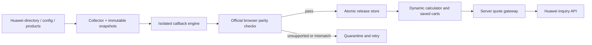

# Huawei synchronization: implementation and operations

Implemented 2026-09-29. The [original design](huawei-calculator-sync-plan.md) is a roadmap; this document describes the running implementation and its limits.

## Implemented plan

1. Discover services from Huawei's `menuInfo` directory and regions from its rules. Fetch configuration JavaScript, product JSON, and the shared renderer. Keep content-addressed source snapshots in a separate SQLite database.
2. Interpret upstream callbacks in QuickJS WebAssembly with explicit JSON inputs, no host capabilities, and memory/time limits. Adapt shared component types to one declarative form model. Service-specific React pages and registry edits are unnecessary for compatible new services.
3. Enumerate reachable selector states and numeric boundary samples. Run the official calculator in isolated Chromium with the same source snapshots. Compare visible choices, labels, selections, complete inquiry payloads, currency, component amounts, and total amounts. The official renderer constructs its own requests independently.
4. Publish only passing service/region releases, atomically. Changed or unsupported candidates are quarantined with diagnostics. Retry automatically; retain prior versions and verification evidence. New quotes stop when a newer candidate has failed or verification is older than 24 hours.
5. Render published forms at `/synchronized`. Obtain final prices from Huawei's inquiry API; cache identical full requests for at most 60 seconds and always refresh on save. Persist source/version/time provenance. Integrate saved products with existing cart editing, cloning, sharing, JSON import/export, Excel price normalization, and API-key product creation through shared server pricing.
6. Run a separate scheduled worker container sharing only the synchronization database with the app. Ordinary compatible data changes require no rebuild or human approval.



## Coverage and deliberate limits

The automated publication scope is currently **pay-per-use, quantity one**, with common radio/select/switch/stepper components whose behavior passes independent checks. Existing calculators and their billing modes remain available. This is not a completed migration of all Huawei services.

The live pilot covers NAT Gateway in `ap-southeast-1` and `sa-brazil-1`: public/private gateways, four sizes each, and two durations per state, for **32 independent cases**. The generic worker discovered 105 service records in the captured menu. Discovery does not mean verified support.

Unknown controls, billing extensions, unresolved dependencies, empty catalogs, differing requests, or excessive state counts prevent publication. ECS, Flexus, subscription modes, repeated resources, and more complex shared components have not been migrated. Compatible newly discovered services can publish unattended; arbitrary new component semantics cannot. There is no autonomous code-writing/deployment agent.

Selector states are exhaustively enumerated up to 128 states per scope. Numeric fields use boundary samples; durations use minimum and minimum plus one. These checks are evidence, not a proof for every numeric input or future upstream change. Price amounts come directly from Huawei rather than a duplicated pricing formula. Configurations with unverified quantity scaling are rejected by the synchronized quote API.

The verifier uses Huawei's iframe rehydration entry point and observes its DOM/network responses. It does not yet test every click-order transition, disabled-state constraint, rendered monetary text, price breakpoint, or optional billing mode from the broader design. Framework hashes are checked; separate untracked future runtime assets must be added to the manifest before claiming compatibility with them. Source collection is not an atomic upstream transaction; configuration and product bodies are rechecked before publication.

## Run locally

```bash
bun install
# Reuse the project's existing configured Huawei network transport.
export HWC_SOCKS5_PROXY=socks5h://172.17.0.1:40001
export HUAWEI_SYNC_DB=/tmp/huawei-sync.sqlite
bunx playwright install chromium
HUAWEI_SYNC_SERVICES=nat HUAWEI_SYNC_REGIONS=ap-southeast-1 bun run sync:calculator:once
# Start the application with the same HUAWEI_SYNC_DB.
bun run sync:calculator
```

Omit service/region filters to discover and rotate through the upstream directory. The initial schedule processes at most ten service/region scopes per cycle, then waits 15 minutes. Directory/config/framework caches last six hours; product cache lasts 15 minutes. Previously active scopes receive priority after six hours. This is a bounded rotating sweep, not a promise that every upstream service gets checked every 15 minutes. Increase resources only after measuring upstream traffic and browser duration.

Environment settings: `HUAWEI_SYNC_DB`, `HWC_SOCKS5_PROXY`, optional comma-separated `HUAWEI_SYNC_SERVICES`/`HUAWEI_SYNC_REGIONS`, `HUAWEI_SYNC_MAX_SCOPES` (1–100), `HUAWEI_SYNC_INTERVAL_MS` (minimum 60000). A database lease is renewed every 30 seconds and expires after two minutes if the worker crashes. Per-scope browser work has a ten-minute case-loop budget and bounded network/teardown timeouts. Failures leave other service scopes intact.

Use `Dockerfile.sync` for the worker. Mount a dedicated volume at `/app/sync-data` in both containers; set `HUAWEI_SYNC_DB=/app/sync-data/huawei-sync.sqlite`. The worker needs the configured proxy, Chromium, and outgoing HTTPS, but no app authentication secret, app-data volume, or public port. Use an init process to reap browser children. The deployment's Compose file is `/home/docker-compose.yml`; it is outside this repository and contains environment-specific settings.

## Diagnostics and recovery

`GET /api/huawei-sync` exposes directory entries, available scopes, verification times/counts, and latest diagnostics. The page shows coverage and last-check time. Worker logs show publication/hold reasons. SQLite `runs`, `attempts`, `releases`, `snapshots`, and `active` retain audit state. No account cookies or authorization headers are recorded in source fixtures.

Failed re-verification of the active release quarantines it and restores its previous pointer if available. The app still checks source status, engine version and freshness before returning a current quote; rollback cannot make a known obsolete source valid. Existing saved estimates remain readable. Startup/network failures never produce zero-price fallbacks.

Back up SQLite with its backup API or `VACUUM INTO`, not by copying a live database without its WAL. Keep snapshots for reproducibility; retention/compaction and operational alert integrations remain future work. Monitor disk use and worker progress.

## Validation

- Unit tests cover isolation, execution limits, derived NAT payloads, conditional duration units, state enumeration, unsupported controls, immutable versions, leases, rollback, directory retirement, full-request caching, partial/invalid quote rejection, and automatic publication using a stubbed independent verifier.
- Live worker runs separately prove official-browser parity; mocked unit evidence is never used to seed production.
- `tests/synchronized.playwright.ts` exercises actual published forms, live pricing, stale/invalid inputs, authentication, save/reopen/edit, clone, API-key pricing, sharing and JSON export/import on an isolated instance.
- `tests/architecture-smoke.playwright.ts` retains existing calculator/cart regression coverage. `bun run test`, `bunx tsc --noEmit`, `bun run lint`, and production Docker builds complete the checks.

The next expansion should add one shared component/billing contract at a time, with independent browser evidence and saved-data regression checks. Do not add service-specific guessed formulas or claim the remaining roadmap is already implemented.
